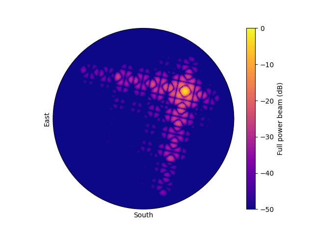
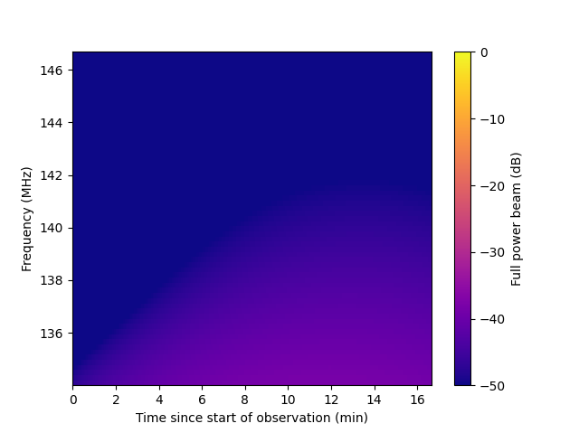
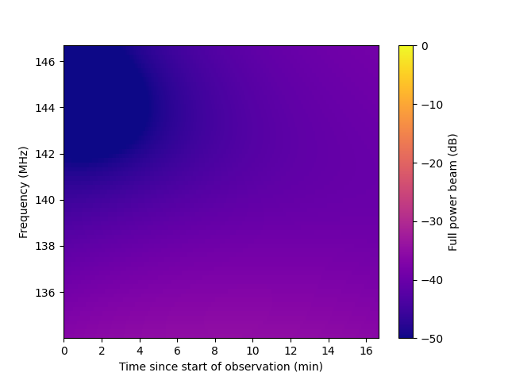

[](https://opensource.org/licenses/MIT) [](https://doi.org/10.5281/zenodo.15114900)

# SHIMMERR

SHIMMERR (Station Heterogeneity Impact on Multi-dimensional beam-Modelling Errors simulatoR and calibratoR) is a python package created to simulate the effect of beam errors on hierarchical stations in radio-interferometers. It has mostly been developed around usage with LOFAR-HBA, but is able to ingest any hierarchical interferometer and vary the gains of elements within the station. Furthermore, it has a built-in DDECal module to calibrate data with perturbed beams. Currently, SHIMMERR only contains a single polarisation (treated as Stokes I).

## Example usage

### Inspecting perturbed beams
The `load_array` submodule can be used to either load a LOFAR Station (packaged with SHIMMERR), or read an array from a CSV file with ETRS coordinates (with `load_array_from_file`).
```
from shimmerr.load_array import load_LOFAR
interferometer = load_LOFAR(mode="Dutch_sensitive", pointing_ra=0, pointing_dec=90)
station = interferometer["RS503HBA"]
```

The pointing can also be changed later, for example pointing to Cassiopeia A:
```
station.update_station_pointing(new_pointing_ra=350.8575, new_pointing_dec=58.148167)
```

The beam can then be plot in either the spatial dimensions or the spectrotemporal dimension:

```
from shimmerr.visualization import plot_spatial_beam, plot_spectrotemporal_beam

plot_spatial_beam(
    station,
    n_altitude=250,
    n_azimuth=500,
    frequency=150e6,
    vmin=-50,
    time="2025-03-21T15:00:00.000",
    antenna_mode="simplified",
    beam_plot_mode="power",
    beam_value_mode="full",
)

plot_spectrotemporal_beam(
    station,
    right_ascension=16.135,
    declination=40.733889,
    vmin=-50,
    utc_starttime="2025-03-21T15:00:00.000",
    antenna_mode="simplified",
    beam_plot_mode="power",
    beam_value_mode="full",
    number_of_timeslots=500,
)
```

The resulting beams are

Spatial | Spectrotemporal
:---:|:---:
|

Errors can be introduced to compare how this changes the beam:

```
# Add random gain drift to tile gains
station.add_random_gain_drift(sigma_tile=1e-2, sigma_antenna=0)

# Break a few individual dipole antennas
station.break_elements(mode="typical", number=5)

# Control an individual tile gain (element of a station)
station.elements[5].g = 2 + 0.1j

# Or an individual dipole (element of a tile --> element of an element)
station.elements[5].elements[8].g = 1 + 1j

plot_spatial_beam(
    station,
    n_altitude=250,
    n_azimuth=500,
    frequency=150e6,
    vmin=-50,
    time="2025-03-21T15:00:00.000",
    antenna_mode="simplified",
    beam_plot_mode="power",
    beam_value_mode="full",
)

plot_spectrotemporal_beam(
    station,
    right_ascension=16.135,
    declination=40.733889,
    vmin=-50,
    utc_starttime="2025-03-21T15:00:00.000",
    antenna_mode="simplified",
    beam_plot_mode="power",
    beam_value_mode="full",
    number_of_timeslots=500,
)
```
The resulting beams are

Spatial | Spectrotemporal
:---:|:---:
|

More examples of using these functions can be found in `example_scripts`
### Calibration

A simple calibration example. For calibrating, we need an interferometer and a sky model, for example:

```
from shimmerr.sources import Skymodel
from shimmerr.load_array import load_LOFAR

skymodel = Skymodel("files/skymodels/NCP_Cas_Cyg_3source.txt")


interferometer = load_LOFAR(mode="EoR", pointing_dec=90)
for station in interferometer.keys():
    interferometer[station].break_elements(
        mode="maximum",
        number=2,
    )
```

Then, we can predit visibilities to calibrate on

```
from shimmerr.visibility import predict_data
import numpy as np

predict_data(
    array=interferometer,
    skymodel=skymodel,
    frequencies=np.arange(135e6, 147e6, 195e4),
    start_time_utc= "2025-03-31T15:48:38",
    filename="cal_test",
    data_path=<user folder>,
    time_resolution=60,
    duration=1, 
    antenna_mode="simplified",
    basestation="CS002HBA0",
    reuse_tile_beam=False,
    SEFD=3e3,
)
```

And then we can run the calibration
```
from shimmerr.calibration import DDEcal

calibrator = DDEcal(
    array=interferometer,
    reference_station="CS002HBA0",
    n_channels=1,
    n_times=5,
    uv_lambda=[250, 5000],
    antenna_mode="simplified",
    update_speed=0.2,
    smoothness_scale=2e6,
    n_iterations=50,
)

results = calibrator.run_DDEcal(
    visibility_file=f"{folder}/cal_test/data.csv",
    fname="my_gains",
    skymodel=skymodel,
    reuse_predict=False,
)
```

The user can then use the `plot_gains` or `plot_convergence` routines fom `shimmerr.visualization` to inspect the results. Also, `shimmerr.metrics/compute_realized_gains` can be used to find the ideal gain, which can be compared to the estimated gain with `shimmerr.visualization.plot_gain_errors`.

# Documentation
The full Sphinx docs can be found [here](https://stefanie-b.github.io/shimmerr/).


# Installation
Recommended: `pip install shimmerr`

## Requirements
- `astropy`
- `matplotlib`
- `numbda`
- `numpy`
- `pandas`
- `tqdm`
- `Python-casacore`
- `Lofarantpos`

Developed by Stefanie Brackenhoff.
